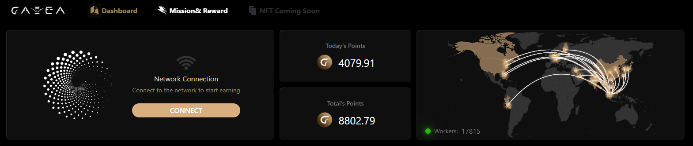
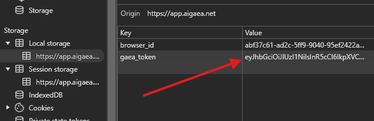

## AIGEA BOT USING PROXY [https://app.aigaea.net/](https://app.aigaea.net/register?ref=gamBazFEV0g4kt)



# Proxy Manager with Aigaea

This is a proxy manager script that interacts with Aigaea's API, allowing you to authenticate with proxies, track scores, and manage browser sessions. The script fetches proxy lists and pings them periodically while managing authentication sessions.

## Requirements

- Node.js (v16 or above)
- npm (Node Package Manager)
- Aigaea account (for obtaining the access token)

## Installation

1. **Clone the repository or download the script**:

    ```bash
    git clone https://github.com/Zlkcyber/aigaea-bot.git
    cd aigea-bot
    ```

2. **Install dependencies**:

    The script requires several packages such as `node-fetch`, `https-proxy-agent`, and `readline`. You can install these by running:

    ```bash
    npm install
    ```

    The necessary packages will be listed in `package.json`.

3. **Create the `proxy.txt` file**:

    The proxy list will be saved to this file, put your proxy there.


## Access Token and first 8 browserID
- You can obtain your token and browser id from the [Aigaea Dashboard](https://app.aigaea.net/register?ref=gamBazFEV0g4kt).

  
- Copy your first 8 browser id
- 
  


## Running the Script

1. **Run the script**:

    After installing the dependencies and setting up the `proxy.txt` file, you can run the script using Node.js:

    ```bash
    npm run start
    ```


## How It Works

 **Proxy Authentication and Pinging**:
    - The script authenticates with Aigaea using your access token.
    - It retrieves a `browser_id` for each proxy, which is stored for future use.
    - Periodically, the script pings the proxies to ensure they are still functional and have a high score.
    - If a proxy's score falls below a certain threshold, it will re-authenticate and retry the ping process.
